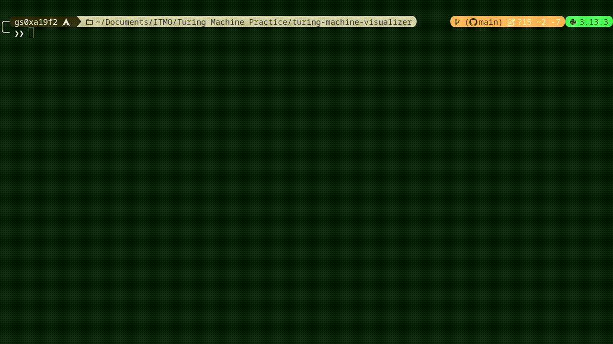
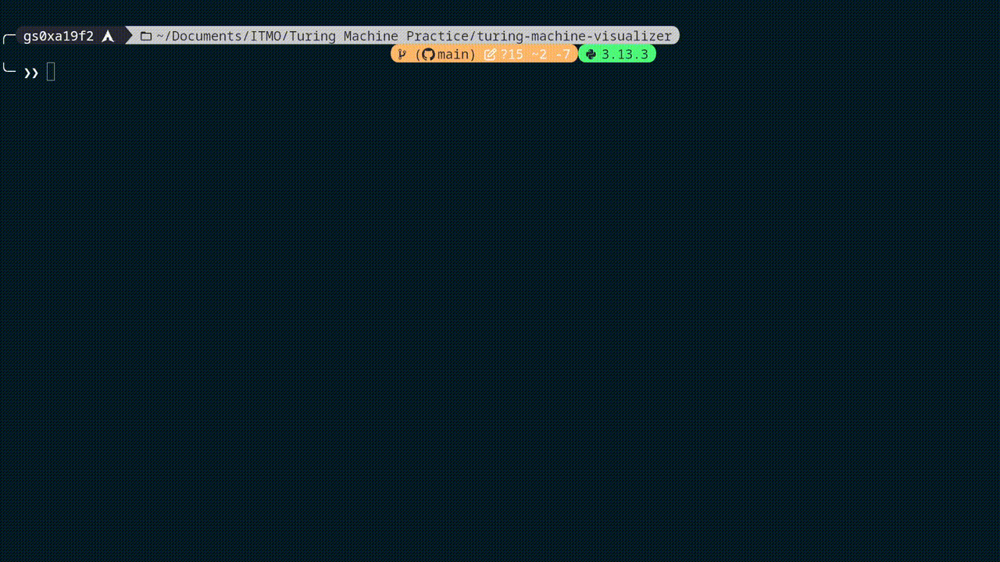
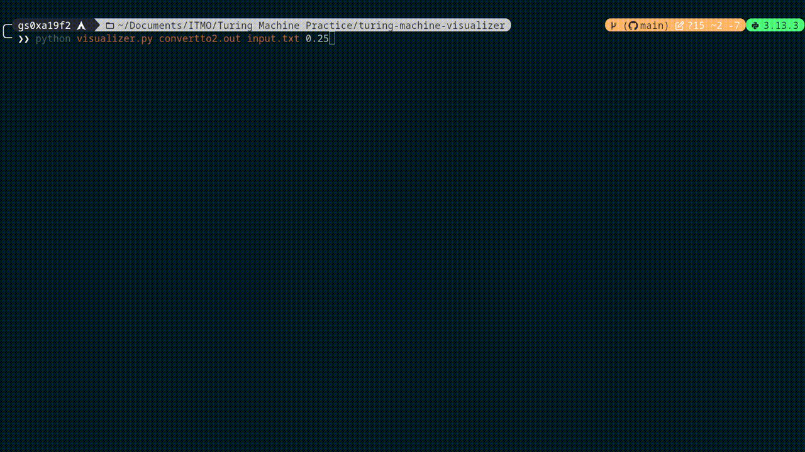
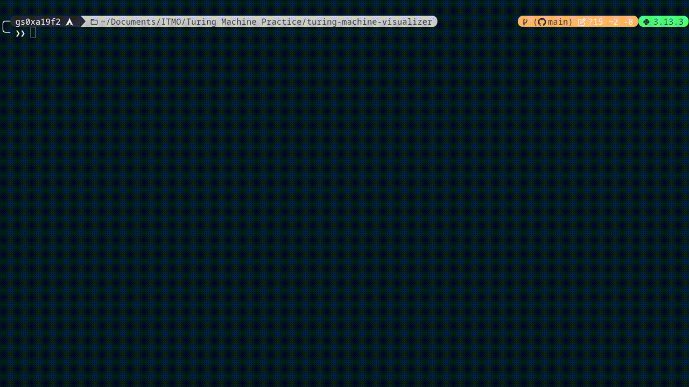

# Turing Machine Practice

## Описание

Данный каталог содержит материалы и результаты практики по работе с Машинами Тьюринга. Включает выходные файлы `.out` для различных задач, текстовый файл с описанием структуры, а также подкаталог с инструментами визуализации.

---

## Авторство

Инструмент визуализации Машин Тьюринга был разработан [BudAlNik](https://github.com/BudAlNik/turing-machine-visualizer).

---

## Содержимое каталога

### Основные файлы
- **`aplusb.out`**: Результат выполнения машины Тьюринга для задачи сложения двух чисел.
- **`balanced.out`**: Выходной файл для задачи проверки сбалансированности скобок.
- **`convertto2.out`**: Результат преобразования числа в двоичную систему счисления из троичной.
- **`factorial.out`**: Выходной файл для задачи вычисления факториала.
- **`infixlogic.out`**: Результат выполнения машины Тьюринга для обработки инфиксной логики.
- **`less.out`**: Выходной файл для задачи сравнения чисел.
- **`mirror.out`**: Результаты для задачи зеркального отображения строки.
- **`multiplication.out`**: Выходной файл для задачи умножения чисел.
- **`postfixlogic.out`**: Результат выполнения постфиксной логики.
- **`reverse.out`**: Выходной файл для задачи реверса строки.
- **`sorting.out`**: Результат выполнения сортировки. Реализация отличается эффективностью, т.к. изначально задача предполагала решение через перебор всех значений в пределах возможных для ввода.
- **`tandem.out`**: Результаты для задачи проверки тандема строк.
- **`zero.out`**: Выходной файл для задачи проверки строки на содержание только нулей.

### Подкаталоги
- **`turing-machine-visualizer/`**: Инструменты для визуализации работы Машин Тьюринга. Подробнее в [README](https://github.com/BudAlNik/turing-machine-visualizer).
- **`Визуализация/`**: Содержит GIF-анимации, демонстрирующие работу различных программ.

---

## Примеры визуализации

### Сложение двух чисел (`aplusb.out`)

---

### Проверка сбалансированности скобок (`balanced.out`)

---

### Конвертация числа в двоичную систему из троичной (`convertto2.out`)

---

### Вычисление факториала (`factorial.out`)

---

### Сортировка чисел (`sorting.out`)

